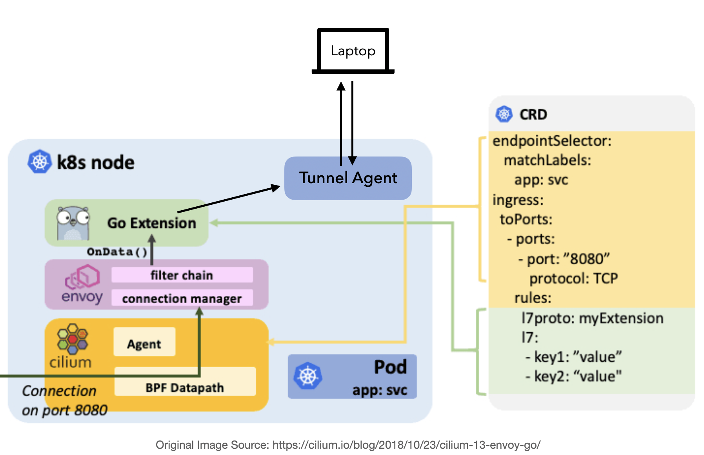

# Aerial

Combination of [Cilium Golang Envoy Filter](https://docs.cilium.io/en/v1.9/concepts/security/proxy/envoy/#go-extensions) 
and TCP tunnel to build [Visual Studio Bridge To Kubernetes](https://devblogs.microsoft.com/visualstudio/bridge-to-kubernetes-ga/).



# Why rebuild Bridge To Kubernetes?

The current version of Bridge To Kubernetes has some limitations, for example:
1. Can't have multiple pods behind a k8s service.
2. Can't have multiple container in a pod.
3. Can't have TLS between pods.

And these limitations can solved by the help of CNI.

Full slides: https://speakerdeck.com/rueian/ciliums-envoy-filter-and-vs-bridge-to-kubernetes

# Example Setup

## Prepare

* gcloud cli
* helm cli 

```shell script
# build tunnel client binary
make

# create the example GKE cluster
export GCP_PROJECT=your-project
./example/gke.sh

# apply example services
kubectl apply -f example/kube.yaml

# make tunnel server accessible from local
kubectl port-forward svc/aerial-tunnel 8080

# redirect http /v1 traffic into service-c from cluster to local 9090 port
./bin/aerial link \
    --addr 127.0.0.1:8080 \
    --bind 127.0.0.1:9090 \
    --svc service-c:80 --param PathRegex=/v1
```